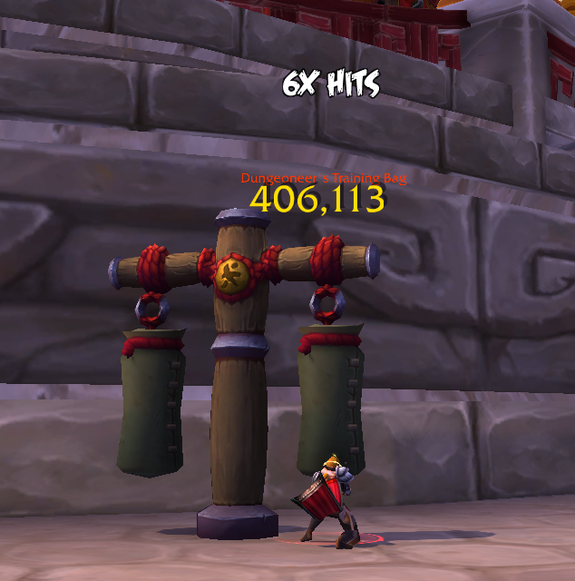
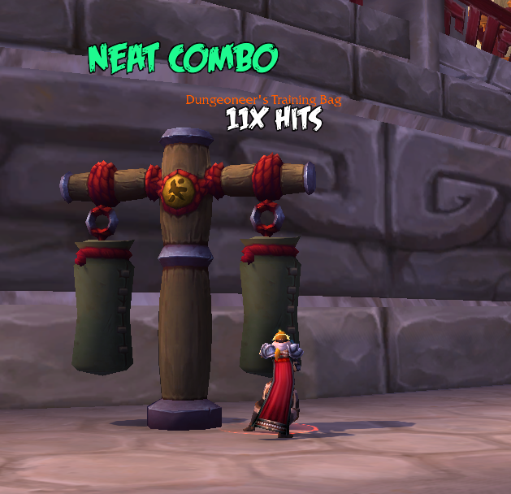
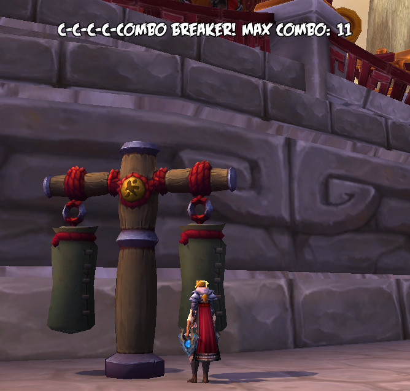

This addon is based on [ComboHitsCounter](https://wow.curseforge.com/projects/combohitscounter?gameCategorySlug=addons&projectID=253773) by Marcelino Porcar (@MalkiosED).

The only difference is that it checks if the player is actually Windwalker Monk otherwise the addon will not work (note: this doesn't mean *break*) in any other specializations or classes. In addition, the sounds has been removed and the source code has been significantly rewritten and now supports more different flavor texts.

Type `/combobreaker` to move the position of frames.

Whenever you reach a milestone in combo, i.e. 10 hits or 20 hits, a flavor text will pop up such as *Groovy Combo* or *Savage Combo*. Every time you reach the same milestone, it will usually have a different flavor text so it's not always the same every time!

Currently there are 7 tiers of flavor texts, with each in increasing hit combo requirements, first being 10 and last being 250 hits.

When you repeat same action as previous or the buff `Hit Combo` expires, that's when your combo ends and you'll have to start over!

You can see the project code [here](https://github.com/mrawlingst/ComboBreaker) and report any issues or bugs or even suggestions [here](https://github.com/mrawlingst/ComboBreaker/issues). I cannot promise that I will keep an eye on comments on Curse or anywhere else than Github links I've posted.
